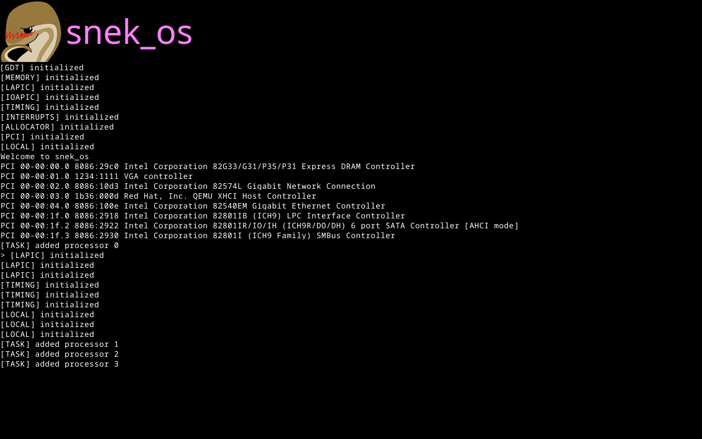

# snek_os

Experimental OS. Aiming to have:

- [x] Lightweight cooperative scheduler
- [ ] WebAssembly userspace
- [ ] Reasonable collection of networking drivers to run on real systems

## Building

```shell
  $ make
```

## Running in QEMU

```shell
  $ make run
```

## Running elsewhere

Grab `out/x86_64-unknown-none/debug/snek_os.iso` and use as needed.


